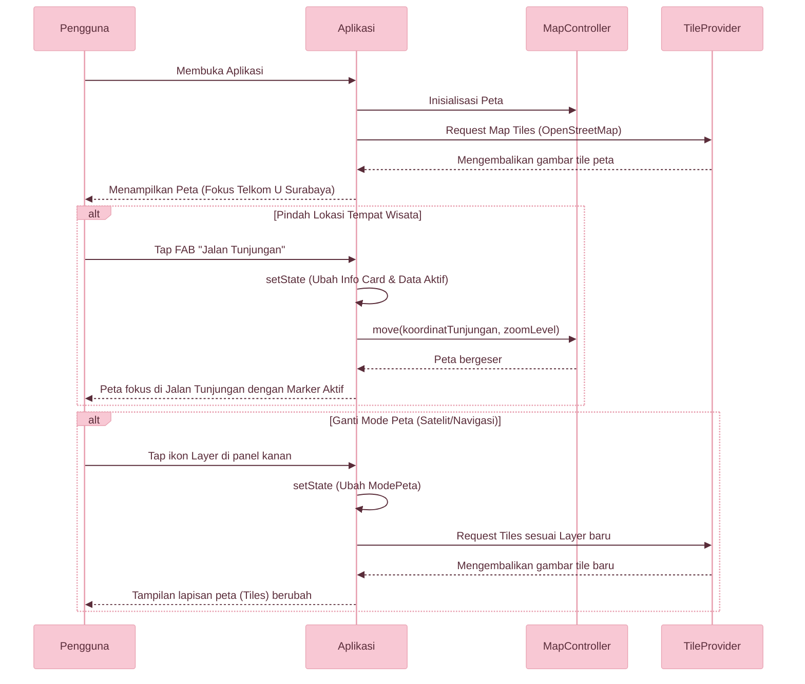

# Flutter Maps - Tugas 7: Implementasi Fitur Maps

| Informasi | Keterangan |
|---|---|
| Nama Lengkap | Nur Alifia Rustan |
| NIM | 1202230008 |
| Mata Kuliah | Aplikasi Perangkat Bergerak (APB) |

---

Flutter Maps adalah aplikasi Flutter yang dikembangkan untuk memenuhi Tugas 7 mata kuliah Aplikasi Perangkat Bergerak (APB). Aplikasi ini mengimplementasikan library `flutter_map` untuk menampilkan peta interaktif yang responsif. Aplikasi difokuskan untuk menampilkan rute/lokasi awal dari Telkom University Surabaya, dan dilengkapi dengan interaksi *Floating Action Button (FAB)* yang memungkinkan pengguna untuk berpindah secara dinamis ke lokasi tempat wisata populer di Surabaya, yaitu Jalan Tunjungan.

---

## Fitur Utama

| Fitur | Keterangan |
|---|---|
| **Peta Interaktif** | Peta interaktif mendukung interaksi penuh seperti *drag, pan, rotasi,* dan *pinch-to-zoom*. |
| **Beragam Mode Peta** | Menyediakan 3 lapis tampilan peta: Standar (OSM), Satelit (Esri World Imagery), dan Navigasi (CartoDB). |
| **Custom Marker** | Pin/Marker kustom berbentuk teardrop modern untuk menandakan titik lokasi yang aktif. |
| **FAB Pindah Lokasi** | Tombol pintar di kanan bawah layar untuk meloncat / berpindah instan antara Telkom University Surabaya dan Jalan Tunjungan. |
| **Kontrol Zoom & Arah** | Tombol kontrol manual (Zoom In `+`, Zoom Out `-`) serta reset kompas ke arah Utara. |
| **Animasi & UI Modern** | Tampilan *floating card* dengan efek animasi transisi dan tipografi modern menggunakan `Google Fonts (Poppins)`. |

---

## Alur Arsitektur



---

## Struktur Kelas

```text
HalamanPeta          - Halaman utama (StatefulWidget) berisi struktur Stack peta dan UI
_Lokasi              - Model data untuk menyimpan informasi lokasi, koordinat, dan label
_KartuPutih          - Widget reusable untuk background kontainer dengan shadow
_KartuInfo           - Widget melayang untuk menampilkan detail nama dan alamat lokasi
_TombolKontrol       - Kumpulan widget aksi map (Zoom In, Zoom Out, Reset Utara)
_FabPindah           - Widget Floating Action Button dinamis untuk beralih lokasi
_PinMarker           - CustomPainter untuk menggambar marker / pin lokasi di atas peta
```

---

## Bukti Hasil (Screenshot)


